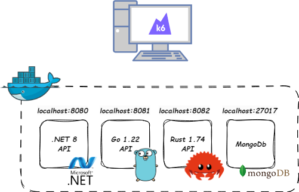
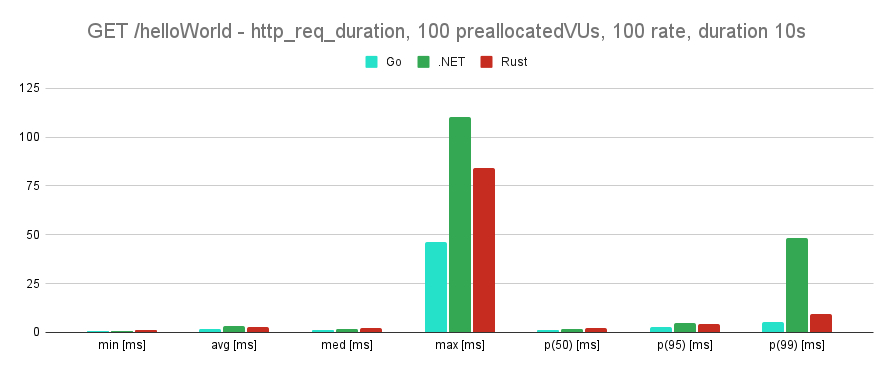
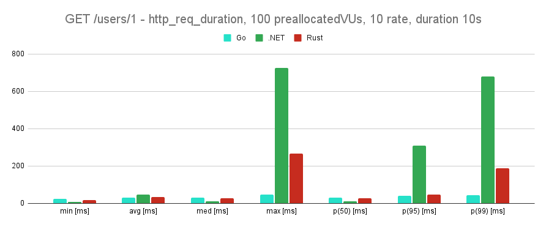

# DotnetGoRustBenchmark
[](https://www.codefactor.io/repository/github/arturmareknowak/dotnetgorustbenchmark)

I have wanted to step into the shoes of a QA engineer so I decided to implement the same contract in three different technologies and run a simple benchmark

## Table of contents
* [General info](#general-info)
* [Benchmark](#benchmark)
* [Technologies](#technologies)
* [Setup](#setup)
* [Status](#status)
* [Inspiration](#inspiration)

## General info

I have built three simple application which all implement the same contract which is:

```
curl -X GET -H "Content-Type: application/json" http://localhost:8080/helloWorld
```

responds with

```
{
    "message": "Hello world!"
}
```

The same response is for ports 8081 and 8082. And also second endpoint which retrieves simple user from MongoDb database:

```
curl -X GET -H "Content-Type: application/json" http://localhost:8080/users/1
```

and the response is 

```
{
    "Id": 1,
    "Name": "Arthur",
    "Surname": "Morgan",
    "Email": "ArthurMorgan@mail.com"
}
```

For ports 8081 and 8082 response slightly differs, but its only a difference in casing. Overall the project looks like this:

<p align="center">
<p align="center">Pic.1 Visualization of docker compose containers</p>

## Benchmark

Small disclaimer: I really recommend to take those benchmarks with more than a grain of salt and not to jump to any conclusions - I was curious what would be the result but at the end of the day those benchmarks are really closer to toy examples rather than to production grade stress test. I intentionally don't provide any comment about the results

Once the project was finished I wrote simple tests with k6. All three containers got limit of 1 CPU and 512MB of RAM limit in docker compose. MongoDB was not limited. Specification of the physical machine: 

- CPU: Intel(R) Core(TM) i7-9750H CPU @ 2.60GHz
- RAM: 24GB
- OS: Windows 10 Home

After the docker compose was up and running tests were run one by one in order: 

1. Go API - endpoint `GET /helloWorld`
2. .NET API - endpoint `GET /helloWorld`
3. Rust API - endpoint `GET /helloWorld`
4. Go API - endpoint `GET /users/1`
5. .NET API - endpoint `GET /users/1`
6. Rust API - endpoint `GET /users/1`

Below I am presenting the results of `http_req_duration` metric. Benchmark was started with command:

`k6 run --summary-trend-stats "min,avg,med,max,p(50),p(95),p(99)" .\script.js`

Endpoint `GET /helloWorld` has been tested with 100 preallocated virtual users, at rate 100 with duration of 10s:

|      | min [ms] | avg [ms] | med [ms] | max [ms] | p(50) [ms] | p(95) [ms] | p(99) [ms] |
|------| -------- | -------- | -------- | -------- | ---------- | ---------- | ---------- |
| Go   | 0,511    | 1,78     | 1,46     | 46,23    | 1,46       | 2,92       | 5,41       |
| .NET | 0,511    | 3,13     | 1,85     | 110,38   | 1,85       | 4,72       | 48,26      |
| Rust | 1,05     | 2,64     | 2,05     | 84,04    | 2,05       | 4,42       | 9,33       |

<p align="center">
<p align="center">Pic.2 Visualization of the data on a chart</p>

Endpoint `GET /users/1` has been tested with 100 preallocated virtual users, at rate 10 with duration of 10s:

|      | min [ms] | avg [ms] | med [ms] | max [ms] | p(50) [ms] | p(95) [ms] | p(99) [ms] |
|------| -------- | -------- | -------- | -------- | ---------- | ---------- | ---------- |
| Go   | 25,55    | 32,55    | 30,39    | 46,71    | 30,39      | 42,4       | 45,55      |
| .NET | 7,71     | 46,42    | 11,46    | 724,33   | 11,46      | 310,26     | 680,92     |
| Rust | 19,16    | 33,78    | 26,82    | 267,57   | 26,82      | 48         | 187,92     |

<p align="center">
<p align="center">Pic.3 Visualization of the data on a chart</p>


## Technologies
* .NET 8
* Go 1.22
* Rust 1.74
* MongoDb
* Docker
* k6 0.50.0

## Setup
1. Run docker compose in src folder: `docker-compose up`
2. APIs should be accessible from http://localhost:8080, http://localhost:8081 and http://localhost:8082

## Status
Project is: _finished_

## Inspiration
Cause coding is fun